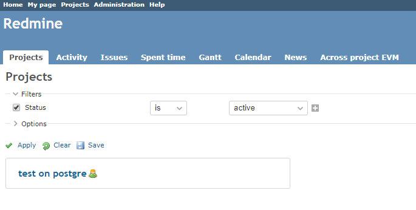
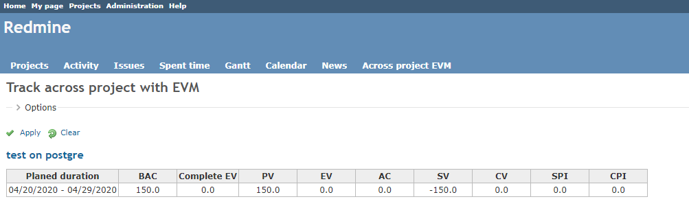

# Track across project with EVM
Calculate the EVM for the following projects and can dawonload csv file.
* Projects in which you are a member
* Any status of the project

## Current Version
1.0.0

## Compatibility
Redmine 3.4.0 and above

# View option

### Status date

You can enter the base date for calculating the EVMa value.

### Working hours per day

Enter the working hours per day and the EVM value will be displayed in days. You can set 7.0 to 8.0 hours. Otherwise, it is calculated as 1.0.

### Status of project

You can select the status of the project

# How to calculate EVM
The below are used for EVM.

* start date
* due date (If empty, effective of version)
* estimated time (If you set it as 0, you will not get PV, CV)
* spent time

If you input these into your project, it can help you to calculate both a single issue’s EVM and whole project’s one.

* PV: Dividing estimated time by the days (from start date to due date(or effective date of version )) to get daily workload
* EV: After issues are closed, you can get EV.　When the progress rate is set, it is calculated by estimated time. (progress rate on the day when the progress is set.)
* AC: Total work hours of PV issues.

**Example**

(1) Create an issue with:

* start date:  2015/08/01
* due date:  2015/08/03
* estimated time: 24 hours

At that time, only PV is calculated. As you have not closed the issue yet, EV equals 0.
PV: Dividing estimated time: 24hours by 3 days (from start date to due date)

| EVM | 8/1 | 8/2 | 8/3 |
| --- | --- | --- | --- |
| PV  | 8   | 16  | 24  |
| EV  | 0   | 0   | 0   |
| AC  | 0   | 0   | 0   |

(2) Input your spent time.

8/1: 10.0hours  8/2: 6.0hours 8/3: 8.0hours

| EVM | 8/1 | 8/2 | 8/3 |
| --- | --- | --- | --- |
| PV  | 8   | 16  | 24  |
| EV  | 0   | 0   | 0   |
| AC  | 10  | 16  | 24  |

(3) After finishing the issue, close it on 8/3. EV will be calculated on 8/3.

| EVM | 8/1 | 8/2 | 8/3 |
| --- | --- | --- | --- |
| PV  | 8   | 16  | 24  |
| EV  | 0   | 0   | 24  |
| AC  | 10  | 16  | 24  |

## About workig days
Include weekends.
Same as if the "Exclude holidays and weekends in duration of days calculation" in redmine_issue_evm plugin is no checked

https://github.com/momibun926/redmine_issue_evm

# Installation
(1) Getting plugin source

**case of zip file.**

* Download zip-file
* Create a folder named redmine_issue_evm under [redmine_root]/plugins/
* Extract zip file in redmine_across_project_evm

**Case of git clone.**

```
git clone https://github.com/momibun926/redmine_across_project_evm [redmine_root]/plugins/redmine_across_project_evm
```

(2) Restart your Redmine web servers (e.g. mongrel, thin, mod_rails).

(3) Click "Project" in top menu



(4) Click "Across project EVM" in application menu



# UnInstall
```
rake redmine:plugins:migrate NAME=redmine_across_project_evm VERSION=0
```

# Contributing
1. Fork it
2. Create your feature branch (git checkout -b my-new-feature)
3. Commit your changes (git commit -am 'Add some feature')
4. Push to the branch (git push origin my-new-feature)
5. Create new Pull Request

# My Environment
*  Redmine version                4.1.1.stable.19730
*  Ruby version                   2.6.0-p0 (2018-12-25) [x86_64-linux]
*  Rails version                  5.2.4.2
*  Environment                    production
*  Database adapter               PostgreSQL
*  Mailer queue                   ActiveJob::QueueAdapters::AsyncAdapter
*  Mailer delivery                smtp
